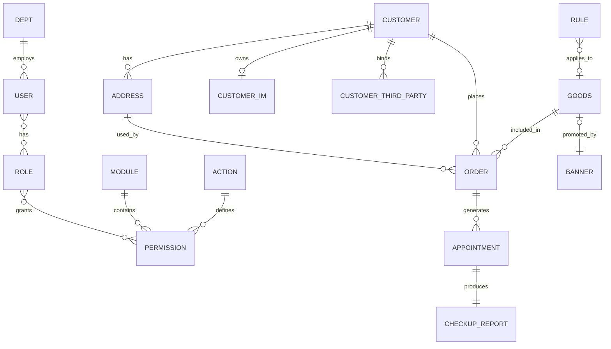

# HIS API (体检中心后台系统接口服务)

> 基于 Spring Boot 构建的体检中心后台系统后端 API 服务，支持体检预约、订单管理、生成报告、实时消息推送等功能。

### **📋 目录**

- [项目信息](#-项目信息)
- [项目亮点](#-项目亮点)
- [技术架构](#-技术架构)
- [系统特性](#-系统特性)
- [项目结构](#-项目结构)
- [数据库设计](#-数据库设计)
- [配置说明](#-配置说明)
- [快速开始](#-快速开始)
- [开发指南](#-开发指南)
- [WebSocket 使用](#-websocket-使用)
- [安全特性](#-安全特性)
- [注意事项](#-注意事项)
- [联系方式](#-联系方式)

---

## 📋 项目信息 

| 项目           | 值                           |
| -------------- | ---------------------------- |
| **项目名称**   | his-api                      |
| **技术栈**     | Spring Boot 2.7.18 + Java 17 |
| **服务端口**   | 7700                         |
| **上下文路径** | /his-api                     |
| **ORM 框架**   | MyBatis-Plus 3.5.3.2         |

---

## ⭐ 项目亮点 

- 🔥 基于 WebSocket + STOMP 实现支付结果与提交体检报告生成请求的实时推送，替代传统轮询方案，显著降低接口压力并提升用户体验
- 🔥 使用异步任务解耦报告生成流程，将耗时操作后台化处理，提高系统吞吐能力与响应速度
- 🔥 基于 Sa-Token 实现 RBAC 权限控制模型，支持细粒度权限校验
- 🔥 实现 WebSocket 鉴权机制（CONNECT 阶段认证 + SUBSCRIBE 阶段资源校验），保障实时通信安全性
- 🔥 基于 Redis + Lua 脚本实现原子化队列计数控制，结合 RabbitMQ 实现排队超时自动回收机制，解决高并发场景下排队人数不一致问题
- 🔥 使用乐观锁（version 字段）解决订单并发更新问题，避免超卖和数据不一致
- 🔥 引入 ShardingSphere 实现读写分离，具备良好的扩展能力

---

## 🏗️ 技术架构

### 核心框架

- Spring Boot 2.7.18 - 应用框架
- MyBatis-Plus 3.5.3.2 - ORM 持久层框架
- Spring Cache - 缓存抽象

### 数据存储

- MySQL 5.7 - 关系型数据库
- MongoDB - 文档数据库
- Redis - 缓存数据库
- Druid 1.2.15 - 数据库连接池
- ShardingSphere 5.2.1 - 数据库读写分离

### 消息队列

- RabbitMQ - 异步消息处理

### 实时通信

- WebSocket + STOMP - 实时消息推送
- SockJS - WebSocket 降级兼容方案

### 安全认证

- Sa-Token 1.34.0 - 权限认证框架
- OAuth - 第三方登录支持（Gitee）

### 对象存储

- MinIO 8.2.1 - 对象存储服务

### 第三方服务集成

- 支付宝 - 支付功能
- 腾讯云 - IM 即时通讯
- 阿里云 - 短信服务

### 工具库

- Hutool 5.8.12
- Lombok 1.18.30
- MapStruct 1.5.5.Final
- ZXing 3.5.3
- Apache POI 5.2.3

### 任务调度

- XXL-Job 2.4.1

---

## ✨ 系统特性

- 用户管理与权限控制
- 体检预约与报告管理
- 订单管理（支持超时自动取消）
- 商品与促销管理
- 客户信息与地址管理
- 文件上传与对象存储
- 第三方支付与登录
- IM 即时通讯
- 实时消息通知（支付结果 / 报告生成）

---

## 📁 项目结构

```
his-api
├── .env.example                                  # 环境变量示例
├── .gitignore
├── README.md
├── pom.xml                                       # Maven 项目配置（依赖/插件/构建）
├── db                                            # 数据库相关脚本（建议纳入版本管理）
│   ├── schema.sql                            	  # 建库建表、索引、约束
│   └── data.sql                                  # 最小初始化数据
└── src
    └── main
        ├── java/com/leehuang/his/api
        │   ├── HisApiApplication.java                # Spring Boot 启动类
        │   ├── async                                 # 异步初始化/异步任务
        │   ├── common                                # 通用返回体、枚举、工具、校验
        │   │   ├── constants                         # 常量（mq、redis 等）
        │   │   ├── enums                             # 业务枚举
        │   │   ├── request                           # 通用请求对象
        │   │   ├── utils                             # 工具类（分页、二维码、MinIO 等）
        │   │   └── validation                        # 分组校验标记
        │   ├── config                                # 配置（MyBatis、Redis、XxlJob、XSS）
        │   ├── db                                    # 数据访问层
        │   │   ├── dao                               # Mapper/DAO 接口
        │   │   ├── entity                            # 数据库实体
        │   │   └── pojo                              # 额外 POJO/DTO
        │   ├── exception                             # 业务异常与统一错误码
        │   ├── front                                 # 前台端（C 端）模块
        │   │   ├── controller                        # 前台接口
        │   │   ├── dto                               # 前台请求/响应 DTO、VO
        │   │   └── service                           # 前台服务及实现
        │   ├── interceptor                           # 拦截器（如 websocket 鉴权）
        │   ├── job                                   # XXL-Job 定时任务
        │   ├── mis                                   # 管理后台模块
        │   │   ├── controller                        # 后台管理接口
        │   │   ├── dto                               # 后台请求/响应 DTO、VO
        │   │   ├── mapper							  # MapStruct 转换
        |   |   └── service                           # 后台服务及实现
        │   └── mq                                    # RabbitMQ 消息
        │       ├── consumer                          # mq 消息消费者
        │       ├── message                           # 消息体定义
        │       └── producer                          # mq 消息生产者
        └── resources
            ├── application.yaml                      # 主配置（profile / server）
            ├── application-*.yaml                    # 按模块拆分配置
            └── mapper                                # MyBatis XML 映射文件
```

---

## 🗄️ 数据库设计

### 数据库环境

| 组件         | 版本/说明            |
| ------------ | -------------------- |
| **主数据库** | MySQL 5.7            |
| **ORM 框架** | MyBatis-Plus 3.5.3.2 |
| **连接池**   | Druid 1.2.15         |
| **读写分离** | ShardingSphere 5.2.1 |

### 核心实体关系图 (ER Diagram)



### 主要数据表

#### 1. 用户与权限模块

| 表名                      | 说明             | 主要字段                                                     |
| ------------------------- | ---------------- | ------------------------------------------------------------ |
| `tb_user`                 | 后台系统用户表   | id, username, password, name, tel, email, role, root, deptId, status |
| `tb_customer`             | 前台商城客户表   | id, username, password, name, sex, tel, email, photo, thirdParty |
| `tb_customer_third_party` | 客户第三方绑定表 | id, customerId, platform, openId, nickname, avatar           |
| `tb_role`                 | 角色表           | id, roleName, permissions, desc, defaultPermissions, systemic |
| `tb_module`               | 菜单模块表       | id, moduleCode, moduleName                                   |
| `tb_action`               | 操作行为表       | id, actionCode, actionName                                   |
| `tb_permission`           | 权限表           | id, permissionName, moduleId, actionId                       |
| `tb_dept`                 | 部门表           | id, deptName, tel, email, desc                               |

#### 2. 核心业务模块

| 表名                         | 说明           | 主要字段                                                     |
| ---------------------------- | -------------- | ------------------------------------------------------------ |
| `tb_goods`                   | 体检套餐商品表 | id, code, title, description, checkup1-4, checkup, image, initialPrice, currentPrice, salesVolume, type, tag, partId, ruleId, status |
| `tb_order`                   | 订单表         | id, customerId, goodsId, snapshotId, addressId, goodsTitle, goodsPrice, number, payableAmount, discountAmount, totalAmount, status, paymentType, transactionId, refundAmount, version |
| `tb_appointment`             | 套餐预约表     | id, uuid, orderId, appointmentDate, name, sex, pid, birthday, tel, appointmentDesc, status, createTime, checkinTime, completedTime |
| `tb_appointment_restriction` | 预约限制表     | id, appointmentDate, actualLimit, everydayLimit, actualAppointment, remark |
| `tb_checkup_report`          | 体检报告表     | id, appointmentId, resultId, status, filePath, waybillCode, date, generatedTime, generateType |

#### 3. 辅助功能模块

| 表名                 | 说明               | 主要字段                                                     |
| -------------------- | ------------------ | ------------------------------------------------------------ |
| `tb_address`         | 地址表             | id, customerId, name, tel, province, city, district, regionCode, detail, isDefault |
| `tb_customer_im`     | 客户 IM 登录记录表 | id, customerId, loginTime                                    |
| `tb_flow_regulation` | 科室调流表         | id, place, realNum, maxNum, weight, priority, blueUuid       |
| `tb_banner`          | 首页轮播图表       | id, name, goodsId, remarks, image, status                    |
| `tb_rule`            | 促销规则表         | id, name, rule, remark                                       |
| `tb_system`          | 系统配置表         | id, item, value, remark                                      |

### 数据库初始化脚本

项目提供：

```text
db/
├── schema.sql   # 建表
├── data.sql     # 初始化数据
```

使用方式

```bash
# 1.创建数据库
CREATE DATABASE his;

# 2.进入数据库（重要：确保后续操作在 his 库中进行）
USE his;

# 3.运行建表脚本 (修改为实际文件路径)
source /path/to/your/db/schema.sql;

# 4.运行初始化数据脚本（修改为实际文件路径）
source /path/to/your/db/data.sql;
```

### 说明

- schema.sql：表结构
- data.sql：基础数据（管理员 / 测试用户）

---

## ⚙️ 配置说明

### 环境配置

项目采用模块化配置，通过 `spring.profiles.include` 引入以下配置模块：

- `application-cache.yaml` - 缓存配置 (Redis)
- `application-database.yaml` - 数据库配置 (MySQL, MongoDB)
- `application-mq.yaml` - 消息队列配置 (RabbitMQ)
- `application-oauth.yaml` - OAuth 认证配置
- `application-oss.yaml` - 对象存储配置 (MinIO)
- `application-thirdparty.yaml` - 第三方服务配置
- `application-security.yaml` - 安全配置

### 环境变量配置

复制 `.env.example` 为 `.env` 并配置以下环境变量：

```bash
# Redis
REDIS_PASSWORD=your_redis_password

# 数据库
MYSQL_ROOT_PASSWORD=your_mysql_password
MONGODB_PASSWORD=your_mongodb_password

# 消息队列
RABBITMQ_PASSWORD=your_rabbitmq_password

# 对象存储
MINIO_SECRET_KEY=your_minio_secret_key

# 阿里云
ALIYUN_ACCESS_KEY_ID=your_access_key_id
ALIYUN_ACCESS_KEY_SECRET=your_access_key_secret

# 支付宝
ALIPAY_APP_ID=your_app_id
ALIPAY_PRIVATE_KEY=your_private_key
ALIPAY_PUBLIC_KEY=alipay_public_key

# 腾讯云
TENCENT_IM_SECRET_KEY=your_im_secret_key
TENCENT_CLOUD_SECRET_ID=your_secret_id
TENCENT_CLOUD_SECRET_KEY=your_secret_key

# OAuth (Gitee)
GITEE_CLIENT_ID=your_client_id
GITEE_CLIENT_SECRET=your_client_secret
```

---

## 🚀 快速开始

### 前置要求

- JDK 17+
- Maven 3.6+
- MySQL 5.7
- Redis
- MongoDB
- RabbitMQ
- MinIO

### 🐳 可选：Docker 环境部署（推荐）

项目依赖服务较多，推荐使用 Docker 一键启动：

- MySQL（支持单机或主从架构）
- Redis
- MongoDB
- RabbitMQ
- MinIO
- XXL-Job

示例端口映射：

| 服务     | 端口               |
| -------- | ------------------ |
| MySQL    | 7001 / 7002 / 7003 |
| Redis    | 6379               |
| MongoDB  | 27017              |
| RabbitMQ | 5672 / 15672       |
| MinIO    | 9000               |

### 安装步骤

1. **克隆项目**

```bash
git clone <repository-url>
cd his-api
```

2. **配置环境变量**

```bash
cp .env.example .env
# 编辑 .env 文件，填入实际配置值
```

3. **修改配置文件**

根据实际环境修改 `src/main/resources/application-dev.yaml` 或其他环境配置文件。

4. **构建项目**

```bash
mvn clean install
```

5. **运行项目**

```bash
# 方式一：使用 Maven
mvn spring-boot:run

# 方式二：运行 JAR
java -jar target/his-api-0.0.1-SNAPSHOT.jar

# 方式三：指定工作节点 ID (分布式场景)
java -Dworker.id=1 -Ddatacenter.id=0 -jar target/his-api-0.0.1-SNAPSHOT.jar
```

### 访问地址

启动成功后，访问：

- **API 基础地址**: `http://localhost:7700/his-api`

---

## 🔧 开发指南

### 添加新的 API 接口

1. 在 `front` 或 `mis` 包下创建 Controller 类
2. 使用 `@RestController` 注解
3. 定义请求映射和方法

### 数据库操作

1. 在 `db.dao` 包下创建 DAO 接口
2. 继承 MyBatis-Plus 的 BaseMapper
3. 在 `mapper` 目录下创建对应的 XML 文件 (如需自定义 SQL)

### 异步任务

使用 `@Async` 注解标记异步方法，需要注入 `InitializeWorkAsync` 或自定义异步服务类。

### 定时任务

在 `job` 包下创建任务类，使用 XXL-Job 或 Spring Schedule 进行调度。

---

## 💬 WebSocket 使用

### 架构说明

本项目使用 **WebSocket + STOMP** 协议实现实时消息推送：

- **连接端点**: `/his-api/ws` (支持 SockJS 降级)
- **消息代理**: 简单内存代理，支持 `/topic` 广播主题
- **应用前缀**: `/app` (客户端发送消息到服务器)
- **认证方式**: CONNECT 头中携带 `Authorization: Bearer {token}`

### 使用场景

1. **支付状态通知**: 订单支付完成后，实时推送支付结果到前端
2. **体检报告通知**: 体检报告生成后，实时推送通知到前端

### 前端连接示例 (JavaScript)

```javascript
import { useWebSocket } from '../../utils/useWebSocketUtil';

const { connect, disconnect } = useWebSocket();

connect(token, (message) => {
    const result = JSON.parse(message.body);
    if (result.outTradeNo !== orderData.value.outTradeNo) return;

    if (result.status === 'success') {
        handlePaymentSuccess(orderData.value.outTradeNo);
    } else if (result.status === 'failure') {
        handlePaymentFailure(orderData.value.outTradeNo);
    }
}, `/topic/payment/${orderData.value.outTradeNo}`);
```

### 后端发送消息

```java
@Resource
private SimpMessagingTemplate messagingTemplate;

// 向特定主题发送消息
messagingTemplate.convertAndSend(
  "/topic/payment/" + orderNo,
  paymentResult
);
```

### 注意事项

- 前端需使用 SockJS 客户端连接 `/his-api/ws` 端点
- 连接时需在 `Authorization` 头中携带 `Bearer {token}`
- 订阅主题格式：`/topic/payment/{订单号}` 或 `/topic/checkup-report`
- 仅支持认证用户订阅与自己相关的话题，防止越权访问

---

## 🔐 安全特性

- Sa-Token 权限认证
- XSS 防护过滤器
- 接口访问控制
- OAuth 第三方登录
- 敏感数据加密存储
- WebSocket 连接认证 (基于 Token 的 STOMP 拦截器)
- 订阅权限校验 (防止越权接收消息)

---

## 📝 注意事项

1. **雪花算法配置**: 分布式部署时需确保每个节点的 `worker-id` 和 `datacenter-id` 唯一
2. **订单超时处理**: 默认订单超时时间为 30 分钟，可通过 `app.order.overdue-minutes` 配置
3. **文件上传限制**: 默认单文件最大 20MB，可根据需要调整

---

## 📞 联系方式

- Email: [lihuang_0426@163.com](mailto:lihuang_0426@163.com)

- GitHub: https://github.com/LeeHuang1998
